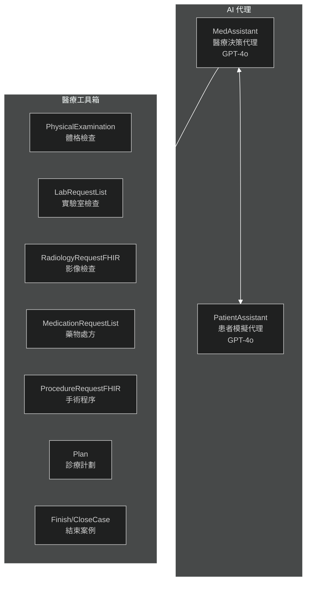
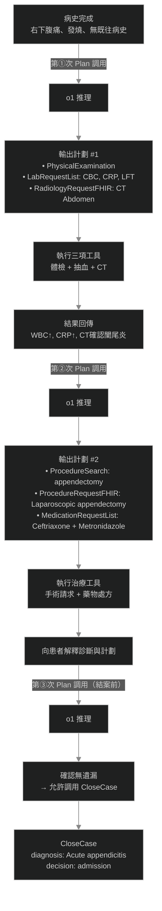

# MIRA 醫療代理完整流程解析

> **文檔日期**: 2026-07-09
> **適用版本**: MIRA v0.1.0

---

## 一、系統角色架構



---

## 二、完整流程詳解

### Phase 1: 病史採集

#### 1.1 患者模擬初始化

患者代理 (`PatientAssistant`) 根據 MIMIC-IV 真實病歷數據模擬患者：

```python
# src/assistants.py:52-138
class PatientAssistant(BaseModel):
    """模擬急診患者"""
    instructions: str = PATIENT_SYSTEM_PROMPT
    # 患者已知：主訴症状、既往史、目前用藥
```

**System Prompt 核心指令** ([routines.py:1-30](src/routines.py#L1-L30))：

- 只回答病歷摘要中的信息，不添加虛構内容
- 被問到未記載的症状時回答「沒有這個症状」
- 用通俗語言回答，不使用醫學術語
- 閉合式問題只回答是/否，開放式問題回答 1-3 句

#### 1.2 醫生代理病史採集

```python
# src/routines.py:33-77 - MEDICAL_SYSTEM_PROMPT
"""
Step 1: Detailed Clinical History
- 獲取詳細病史：主訴、既往史、家族史、用藥、過敏
- 每次最多問 1-2 個問題
- 先用開放式問題，再用定向問題補充
- 完成後調用 Plan 工具開始診斷流程
"""
```

**病史採集範例對話**：

| 醫生 | 患者 |
|:---|:---|
| "您好，請描述您今天的主要不適？" | "我肚子痛，主要是右下腹，從昨天開始..." |
| "疼痛有加重嗎？有沒有發燒？" | "是的，今天更痛了，我有點發燒" |
| "以前有類似情况嗎？正在服用什麼藥？" | "沒有過，我不吃任何藥" |

---

### Phase 2: 診斷規劃與執行

#### 2.1 Plan 工具 - 診療計劃生成器

---

##### 概述

`Plan` 是 MIRA 系統的**核心決策引擎**，也是唯一不使用 GPT-4o 而改用 **o1 推理模型（Chain-of-Thought）** 的工具。每次 `MedAssistant` 需要決定「下一步做什麼」時，都必須先調用 `Plan`，由 o1 生成結構化的行動計劃，然後嚴格照計劃執行。

> **設計哲學**：把「臨床推理」與「工具執行」分離 — GPT-4o 負責溝通與操作，o1 負責深度醫學判斷。

---

##### 2.1.1 工具定義

```python
# src/tools.py:924-927
class Plan(BaseModel):
    """Generate a structured sequence of next actions and steps
    to be taken to complete the patient case."""
    ...
```

`Plan` 是一個**空參數工具（no-arg tool）**：它本身不接收任何輸入字段，所有上下文由系統在調用時自動注入（見 §2.1.3）。

---

##### 2.1.2 調用時機：四個觸發點

根據 `MEDICAL_SYSTEM_PROMPT`（[routines.py:33-77](src/routines.py#L33-L77)），醫生代理被明確指示在以下四個時間點必須調用 `Plan`：

| 時機 | 觸發條件 | 目的 |
|:---|:---|:---|
| **① 病史完成後** | 完成完整病史採集（主訴、既往史、用藥、過敏） | 啟動診斷流程 |
| **② 診斷工具全部執行後** | 所有建議的檢查工具（Lab、Radiology 等）均已調用 | 根據結果制定治療計劃 |
| **③ 治療中期調整** | 新結果改變了臨床判斷 | 動態修正計劃 |
| **④ 結案前最後一次** | 準備調用 `Finish` 或 `CloseCase` 前 | 確保未遺漏任何步驟 |

```
# MEDICAL_SYSTEM_PROMPT 原文摘錄（routines.py:44-61）
"Only once you have completed the complete clinical history,
 choose the `Plan` tool to begin the diagnostic process."
...
"Before finishing, call the `Plan` tool one last time and follow
 all the instructions it gives you before actually finishing."
```

---

##### 2.1.3 數據流：patient_info 的組裝

調用 `Plan` 時，系統不傳遞原始 JSON 參數，而是自動注入 `PatientContext` 的完整字典：

```python
# src/assistants.py:415-416
all_args = self.patient_context.to_dict()
# → 包含: patient_id, patient_info, tools, organization_id, ...
all_args.update(arguments)   # arguments 此時為空 {}
```

`patient_info` 是**完整對話歷史的格式化文字**，在每次助手回覆或工具返回後即時更新：

```python
# src/assistants.py:197-199
def update_patient_info(self):
    """Update the patient info in the patient context."""
    self.patient_context.patient_info = format_conversation(self.message_history)
```

因此，o1 推理模型收到的輸入等同於：**完整的醫患對話紀錄 + 所有已執行工具的返回結果**。

```
# generate_routine() 發送給 o1 的完整 prompt 結構
# src/tool_execs.py:742-775

┌─────────────────────────────────────────────────┐
│  ROUTINE_PROMPT（任務指令 + 輸出格式要求）        │
│                                                 │
│  Available Tools and options:                   │
│  [所有可用工具的 schema 列表，不含 Plan 本身]     │
│                                                 │
│  The patient information so far:                │
│  [format_conversation(message_history)]         │
│  → 醫患完整對話 + 所有工具執行結果               │
└─────────────────────────────────────────────────┘
```

> **注意**：`tools` 傳入的是 `tools_for_planning_routine`，即**故意排除了 `Plan` 本身**，避免 o1 建議再次調用 Plan（[run.py:85-88](src/runs/run.py#L85-L88)）。

---

##### 2.1.4 ROUTINE_PROMPT 結構解析

`ROUTINE_PROMPT`（[routines.py:131-207](src/routines.py#L131-L207)）是 Plan 工具的靈魂，共分四個步驟：

```
Step 1: Review Inputs
  → 審查對話細節，分析已有的檢查結果（體檢、Lab、影像）

Step 2: Analyze Information
  → 評估可能診斷，識別缺失的關鍵數據

Step 3: Determine Next Actions
  → 選擇具體工具並指定詳細參數
  → 使用 if-else 邏輯處理替代方案

Step 4: Structure the Routine
  → 用條件分支格式化輸出行動計劃
```

**輸出質量要求**（關鍵約束）：

| 要求類別 | 具體規定 |
|:---|:---|
| **藥物格式** | 必須提供完整參數：`drug_name`, `dosage_value`, `dosage_unit`, `period`, `period_unit`, `frequency`, `route` |
| **影像選擇** | 優先高準確度工具（CT Chest > Chest X-ray；CT Abdomen > 超聲） |
| **Lab 列表** | 必須涵蓋急診常規 + 病情特異性指標（`all lab values that should be taken`） |
| **用藥完整性** | 必須包含 IV 藥物、抗生素、止痛藥、患者既有用藥（含暫停的）等全部項目 |
| **不重複** | 不建議已執行過的工具或參數（`Do not repeat suggestions that have been already done`） |

**藥物輸出格式示例**（ROUTINE_PROMPT 中明確要求的格式）：

```json
{
  "Drug Name": "Ceftriaxone",
  "Dosage Text": "1 g IV every 24 hours",
  "Dosage Value": 1,
  "Dosage Unit": "g",
  "Period": 24,
  "Period Unit": "h",
  "Frequency": 1,
  "Route": "Intravenous"
}
```

---

##### 2.1.5 Plan 工具的多次調用生命週期

以急性闌尾炎案例為例，`Plan` 在整個流程中被調用三次：



---

##### 2.1.6 工具變體：`generate_routine_optional_admission`

系統存在兩個版本的 Plan 執行函數：

| 版本 | 文件 | 使用場景 |
|:---|:---|:---|
| `generate_routine` | [tool_execs.py:742](src/tool_execs.py#L742) | 標準急診模式（`run.py`） |
| `generate_routine_optional_admission` | [tool_execs.py:782](src/tool_execs.py#L782) | 含住院/出院決策模式（`run_optional_admission.py`） |

後者使用 `routines_optional_admission.py` 中的 `ROUTINE_PROMPT`，要求 o1 在最終計劃中**明確建議住院（admission）或出院（discharge）**決策。

工具映射配置（[run.py:100](src/runs/run.py#L100)）：
```python
func_name_to_func = {
    "Plan": generate_routine,          # 或 generate_routine_optional_admission
    "Finish": finish,
    ...
}
```

---

##### 2.1.7 UI 視覺化標記

Plan 工具的輸出在前端有特殊的可視化呈現（[visualisations.py:86, 257](src/visualisations.py#L86)）：

```python
# 終端模式：顯示生成中動畫
"generate_routine": "**Generating plan ... 🍓🍓🍓**\n\n"

# Gradio 網頁模式：粉紅色標籤
"generate_routine": "bg-pink-100 border-pink-500 text-pink-800"
```

這使得 Plan 的調用在對話流中有別於其他工具，視覺上突出顯示。

---

##### 2.1.8 小結

| 屬性 | 詳情 |
|:---|:---|
| **工具類** | `Plan(BaseModel)` — 空參數，無字段 |
| **執行函數** | `generate_routine()` / `generate_routine_optional_admission()` |
| **使用模型** | `o1`（`REASONING_MODEL`，[config.py:61](src/config.py#L61)）|
| **調用次數** | 每個案例 ≥ 3 次（病史後、診斷後、結案前） |
| **輸入** | ROUTINE_PROMPT + 可用工具 schema + 完整對話歷史 |
| **輸出** | if-else 條件結構的下一步行動計劃（純文字） |
| **執行模式** | 同步（非 async），直接返回字符串結果 |
| **錯誤處理** | 失敗時拋出 `Exception("Could not generate a plan for the patient. Exiting.")` |

#### 2.2 診斷工具執行

每個工具調用都經過統一的異步管道：

```python
# src/tool_execs.py:29-100
async def request_fetch_and_poll(patient_id, hadm_id, handlers, ...):
    """異步執行 FHIR 請求並獲取結果"""

    # 1. 將 Handler 轉為 FHIR ServiceRequest
    service_requests = [handler.to_fhir() for handler in handlers]

    # 2. POST 到 HAPI FHIR Server
    service_request_ids = await asyncio.gather(
        *[_post_resource(sr) for sr in service_requests]
    )

    # 3. 從 MIMIC 數據獲取真實結果
    results = await asyncio.gather(
        *[handler.fetch_result(patient_id, hadm_id) for handler in handlers]
    )

    # 4. 生成 FHIR Observation 資源
    result_resources = await handler.generate_result_resource(...)
```

**可用診斷工具**：

| 工具 | 功能 | 返回内容 |
|:---|:---|:---|
| `PhysicalExamination` | 體格檢查 | 生命體徵、腹部壓痛等 |
| `LabRequestList` | 實驗室檢查 | CBC、肝功能、電解質等 |
| `MicrobiologyRequestList` | 微生物檢查 | 尿培養、血培養 |
| `RadiologyRequestFHIR` | 影像檢查 | CT、X-ray、超声報告 |
| `UrineRequestList` | 尿液檢查 | 尿常规 |

#### 2.3 程序搜索

使用 Qdrant 向量搜索找匹配的手術程序：

```python
# src/tool_execs.py - get_procedure_search_results()
collection = Qdrant_Collection(QDRANT_URL, "mimic_iv_icd_codes_procedures")
results = collection.search(procedure_name, top_k=10)
# 返回: ["Laparoscopic appendectomy", "Open appendectomy", ...]
```

---

### Phase 3: 治療決策

#### 3.1 藥物處方

```python
# src/tools.py:237-407 - MedicationRequestFHIR
class MedicationRequestFHIR(BaseModel):
    drug_name: str          # "Ceftriaxone"
    dosage_value: float     # 1
    dosage_unit: str        # "g"
    period: int             # 24
    period_unit: PeriodUnit # "h"
    frequency: int          # 1
    route: RouteUnit        # "Intravenous"
```

藥物代碼自動解析（NDC、RxNorm、SNOMED CT、ATC）：

```python
# src/tools.py:80-102
def _resolve_medication_codes_safe(drug_name):
    """從 UMLS 獲取標準藥物代碼"""
    return {
        "ndc": "...",
        "rxnorm_code": "...",
        "snomed_ct_code": "...",
        "atc_codes": "..."
    }
```

#### 3.2 手術程序請求

```python
# src/tools.py:734-806 - ProcedureRequestFHIR
class ProcedureRequestFHIR(BaseModel):
    procedure: str  # "Laparoscopic appendectomy"
    # 先用 ProcedureSearch 搜索，再請求具體程序
```

---

### Phase 4: 案例結束

#### 4.1 Finish / CloseCase

```python
# src/tools.py:916-928 - Finish
class Finish(BaseModel):
    diagnosis: str  # "Acute appendicitis"

# src/tools.py:1138-1171 - CloseCase (新版)
class CloseCase(BaseModel):
    diagnosis: str              # "Left lower lobe pneumonia"
    decision: Literal["discharge", "admission"]  # 汻置決策
    reasoning: str              # 汻置理由
```

當調用 `Finish` 或 `CloseCase`：

- `completed_called = True` 標記案例完成
- 對話循環終止
- 結果保存為 `.jsonl` 文件

---

## 三、完整時序圖

```mermaid
%%{init: {
  'theme': 'dark',
  'themeVariables': {
    'primaryColor': '#464040f8',
    'primaryTextColor': '#ffffff',
    'primaryBorderColor': '#ffffff',
    'lineColor': '#ffffff',
    'actorBkg': '#1e1e1e',
    'actorTextColor': '#ffffff',
    'messageColor': '#ffffff',
    'fontSize': '13px'
  }
}}%%

sequenceDiagram
    participant Patient as PatientAssistant
    participant Doctor as MedAssistant
    participant LLM as OpenAI GPT-4o
    participant Reasoner as o1 推理模型
    participant Tools as 工具執行器
    participant FHIR as HAPI FHIR Server
    participant MIMIC as MIMIC-IV 數據

    rect rgb(60, 60, 80)
        Note over Patient,Doctor: Phase 1: 病史採集
        Doctor->>LLM: 對話歷史 + 系統指令
        LLM-->>Doctor: "請描述您的主要症状？"
        Doctor->>Patient: 開放式問題
        Patient->>LLM: 病歷摘要 + 問題
        LLM-->>Patient: "右下腹痛，昨天開始..."
        Doctor->>Patient: 定向問題（發燒？用藥？）
        Patient-->>Doctor: 患者回答
    end

    rect rgb(80, 60, 60)
        Note over Doctor,Reasoner: Phase 2: 診療計劃
        Doctor->>Reasoner: Plan 工具 + 病史摘要
        Reasoner-->>Doctor: if-else 診療計劃
        Note right of Doctor: "建議：腹部 CT + CBC + 體檢"
    end

    rect rgb(60, 80, 60)
        Note over Doctor,MIMIC: Phase 3: 診斷執行
        Doctor->>Tools: LabRequestList(CBC, CRP, ...)
        Tools->>FHIR: POST ServiceRequest
        Tools->>MIMIC: fetch_lab_results(hadm_id)
        MIMIC-->>Tools: WBC 12.5, CRP 45...
        Tools->>FHIR: POST Observation
        Tools-->>Doctor: 實驗室結果

        Doctor->>Tools: RadiologyRequestFHIR(CT, Abdomen)
        Tools->>FHIR: POST ServiceRequest
        Tools->>MIMIC: fetch_radiology_results()
        MIMIC-->>Tools: "急性闌尾炎，未穿孔"
        Tools-->>Doctor: 影像報告
    end

    rect rgb(80, 80, 60)
        Note over Doctor,Reasoner: Phase 4: 治療決策
        Doctor->>Reasoner: Plan 工具 + 診斷結果
        Reasoner-->>Doctor: "建議：闌尾切除術 + 抗生素"

        Doctor->>Tools: ProcedureSearch("appendectomy")
        Tools->>Qdrant: 向量搜索
        Tools-->>Doctor: ["Laparoscopic...", "Open..."]

        Doctor->>Tools: ProcedureRequestFHIR("Laparoscopic appendectomy")
        Doctor->>Tools: MedicationRequestList(Ceftriaxone + Metronidazole)
        Tools->>FHIR: POST ServiceRequest + MedicationRequest
    end

    rect rgb(60, 60, 60)
        Note over Doctor,Patient: Phase 5: 結案
        Doctor->>Patient: 解釋診斷和治療計劃
        Patient-->>Doctor: 確認理解
        Doctor->>Tools: CloseCase(diagnosis="Acute appendicitis", decision="admission")
        Tools-->>Doctor: 案例完成
    end
```



---

## 四、關鍵代碼位置

| 流程階段 | 關鍵文件 | 核心函數/類 |
|:---|:---|:---|
| 病史採集 | [assistants.py](src/assistants.py) | `PatientAssistant`, `MedAssistant.chat()` |
| 診療計劃 | [routines.py](src/routines.py) | `ROUTINE_PROMPT`, `generate_routine()` |
| 工具執行 | [tool_execs.py](src/tool_execs.py) | `request_fetch_and_poll()` |
| FHIR 轉換 | [tools.py](src/tools.py) | `LabRequestFHIR`, `RadiologyRequestFHIR`, `MedicationRequestFHIR` |
| 數據獲取 | [mimic_to_fhir.py](src/mimic_to_fhir.py) | `fetch_lab_results()`, `fetch_radiology_results()` |
| 結案決策 | [tools.py](src/tools.py#L1138-L1171) | `CloseCase(diagnosis, decision, reasoning)` |

---

## 五、實際案例示例（急性闌尾炎）

```
=== 對話回合 1-3 ===
醫生: "請描述您的主要症状？"
患者: "右下腹痛，從昨天開始，越來越痛"
醫生: "有發燒、噁心嗎？"
患者: "有點發燒，噁心，沒嘔吐"

=== Plan 工具調用 ===
o1 模型建議:
  - PhysicalExamination (腹部壓痛評估)
  - LabRequestList (CBC, CRP, LFT)
  - RadiologyRequestFHIR (CT Abdomen)

=== 工具執行結果 ===
體檢: 右下腹壓痛(+), 反跳痛(+), McBurney點壓痛
實驗室: WBC 12.5×10^9/L, CRP 45 mg/L
CT: 急性闌尾炎，未穿孔，長度 8cm

=== 治療決策 ===
ProcedureSearch("appendectomy") → Laparoscopic appendectomy
MedicationRequest: Ceftriaxone 1g IV q24h + Metronidazole 500mg IV q8h

=== CloseCase ===
diagnosis: "Acute appendicitis"
decision: "admission"
reasoning: "需手術治療，住院觀察"
```

---

## 六、系統限制與注意事項

### 6.1 模型配置

當前硬編碼的模型版本（[config.py:49-61](src/config.py#L49-L61)）：

```python
MEDICAL_ASSISTANT_MODEL: str = "gpt-4o"
PATIENT_ASSISTANT_MODEL: str = "gpt-4o"
REASONING_MODEL: str = "o1"
```

### 6.2 對話限制

- 最大對話回合：20（可通過 `max_steps` 配置）
- 溫度設置：0.05（低隨機性，確保一致性）

### 6.3 外部依賴

| 服務 | 端口 | 狀態要求 |
|:---|:---:|:---|
| HAPI FHIR Server | 8080 | 必須運行 |
| Qdrant | 6333 | 必須運行 |
| OpenAI API | - | 需有效 API Key |

---

## 七、擴展指南

### 7.1 添加新診斷類型

1. 在 `config.py` 的 `DATASET_NAMES` 添加診斷名稱
2. 在 `config.py` 的 `SELECTED_HADM_IDS` 添加對應患者 ID
3. 運行 `make_dataset.py` 生成數據集

### 7.2 添加新工具

1. 在 `tools.py` 定義 Pydantic 模型
2. 在 `tool_execs.py` 實現執行函數
3. 在 `run.py` 註冊工具映射

---

*文檔生成時間: 2026-07-09*
