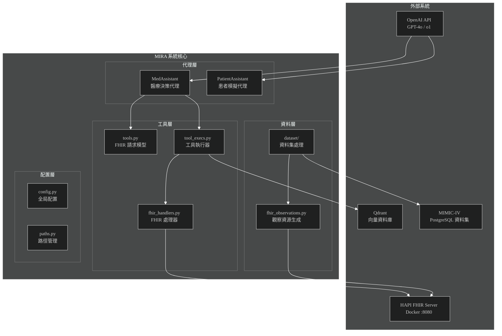
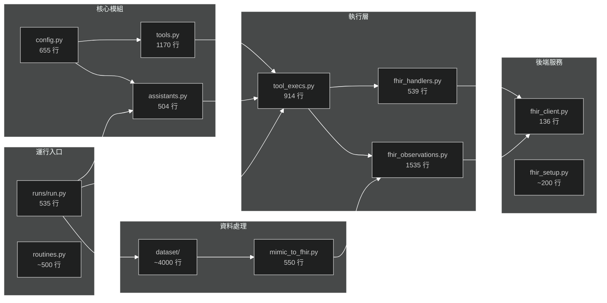
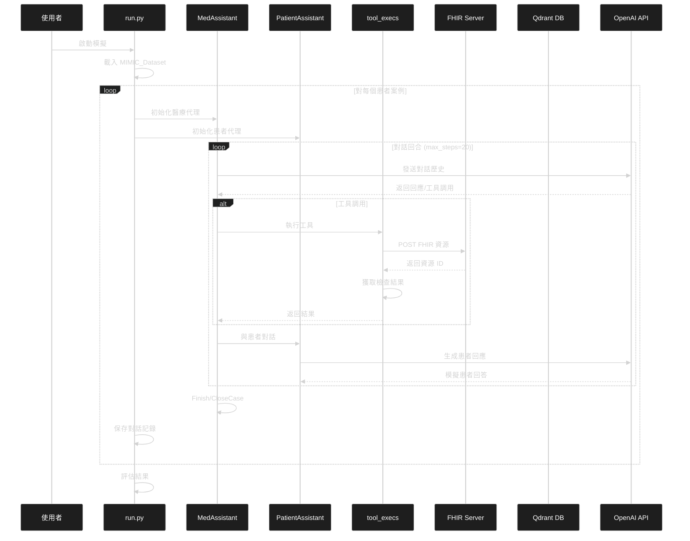
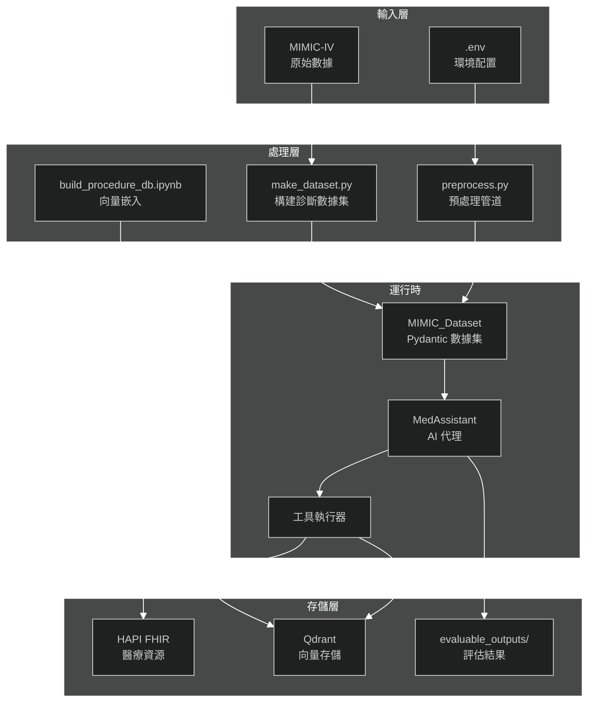

# 系統架構分析報告

> **專案名稱**: MIRA - Towards Autonomous Medical Artificial Intelligence Agents
> **分析日期**: 2026-07-09
> **技術棧**: Python 3.12, OpenAI API, FHIR, Qdrant, FastAPI/Flask

---

## 一、執行摘要

MIRA 是一個**醫療 AI 代理系統**，旨在模擬急診室環境中的醫患交互，從病史採集、診斷到治療決策的完整流程。系統基於 MIMIC-IV 真實醫療數據集，通過 FHIR 標準進行醫療資源交換，並利用 LLM (GPT-4o/o1) 作為推理核心。

---

## 二、系統上下文圖 (C4 Model)



---

## 三、模組依賴矩陣



---

## 四、核心業務流時序圖



---

## 五、架構維度評估儀表板

| 維度 | 現況評分 (1-10) | 關鍵證據 | 潛在風險 |
|:---|:---:|:---|:---|
| **模組解耦** | 6/10 | `tools.py` 定義清晰的 FHIR 請求模型；`tool_execs.py` 負責執行邏輯分離 | `config.py` 包含硬編碼的 HADM_ID 列表 (655行)；跨模組 import 較多 |
| **測試友好度** | 4/10 | 缺少獨立測試目錄；評估邏輯在 `evaluations/` 中 | 主要依賴 Jupyter Notebook 進行驗證；無單元測試框架 |
| **性能瓶頸** | 7/10 | 使用 `asyncio` 進行異步 FHIR 請求；Qdrant 向量搜索優化程序查詢 | `code_maps.py` 單文件 5594 行可能影響載入速度；同步 OpenAI API 調用 |
| **可維護性** | 5/10 | Pydantic 模型提供類型安全；清晰的 README 文檔結構 | `code_maps.py` 巨型文件；`fhir_observations.py` 1535 行職責過重 |
| **擴展性** | 6/10 | FHIR 標準化介面；工具註冊模式 (`@register_class`) | 新診斷類型需修改 `config.py` 中的 `SELECTED_HADM_IDS` |

---

## 六、技術棧分析

### 6.1 核心依賴

| 類別 | 依賴 | 版本 | 用途 |
|:---|:---|:---:|:---|
| **LLM** | openai | 1.44.1 | GPT-4o/o1 推理引擎 |
| **醫療標準** | fhir-resources | 7.1.0 | FHIR R4B 資源模型 |
| **向量數據庫** | qdrant-client | 1.12.0 | 程序代碼向量搜索 |
| **Web 框架** | fastapi, flask | 0.115.4, 3.1.0 | REST API 服務 |
| **數據處理** | pandas, numpy | 2.2.2, 2.1.1 | MIMIC 數據處理 |
| **ML** | transformers, torch | 4.45.2, >=2.7.0 | 嵌入模型 |

### 6.2 外部服務

- **HAPI FHIR Server**: Docker 容器，端口 8080，提供 FHIR R4 規範的醫療資源存儲
- **Qdrant**: 端口 6333/6334，存儲 ICD 程序代碼向量嵌入
- **OpenAI API**: 需要 `OPENAI_API_KEY` 環境變數

---

## 七、複雜度分析

### 7.1 代碼熱點 (潛在 God Files)

| 文件 | 行數 | 職責 | 建議 |
|:---|:---:|:---|:---|
| `code_maps.py` | 5594 | MIMIC 代碼映射字典 | 考慮拆分為按類別的獨立模組或 JSON 配置 |
| `fhir_observations.py` | 1535 | FHIR 觀察資源生成 | 提取通用邏輯到基類，按觀察類型分離 |
| `tools.py` | 1170 | FHIR 請求模型定義 | 可接受，已使用 Pydantic 模式 |
| `tool_execs.py` | 914 | 工具執行邏輯 | 考慮按工具類型拆分 |

### 7.2 高扇入/扇出分析

**高扇入 (被多處調用)**:
- `config.py`: 全局配置被所有模組引用
- `tools.py`: FHIR 請求模型被 `run.py`, `tool_execs.py` 使用
- `backend.fhir_client.post_fhir_resource`: 所有 FHIR 操作的核心入口

**高扇出 (調用多個依賴)**:
- `tool_execs.py`: 依賴 `fhir_handlers`, `fhir_observations`, `qdrant_client`, `transformers`
- `run.py`: 依賴 `assistants`, `tool_execs`, `dataset`, `backend`, `config`

---

## 八、數據流架構



---

## 九、風險評估

### 9.1 P0 風險 (需立即關注)

1. **硬編碼配置** (`config.py:64-655`)
   - `SELECTED_HADM_IDS` 字典包含 8 種診斷的固定患者 ID
   - **影響**: 新增診斷類型需修改源碼
   - **建議**: 遷移至外部配置文件 (YAML/JSON)

2. **缺少錯誤恢復機制** (`assistants.py:202-263`)
   - OpenAI API 調用僅有 `tenacity` 重試，無降級策略
   - **影響**: API 限流時整個模擬可能失敗
   - **建議**: 實現請求隊列與斷路器模式

### 9.2 P1 風險 (計劃性改進)

1. **測試覆蓋不足**
   - 無獨立 `tests/` 目錄
   - **建議**: 引入 pytest + pytest-asyncio

2. **日誌級別硬編碼** (`config.py:11`)
   - `LOG_LEVEL = logging.ERROR` 固定為 ERROR
   - **建議**: 通過環境變數配置

### 9.3 P2 風險 (技術債)

1. **Jupyter Notebook 混合**
   - 多個 `.ipynb` 文件包含核心邏輯
   - **建議**: 將可重用邏輯抽取為 Python 模組

2. **模型版本固化**
   - `config.py:49-61` 硬編碼舊模型版本
   - **建議**: 支持通過配置切換模型

---

## 十、改進建議

### 10.1 架構改進

```python
# 建議: 引入依賴注入模式
# Before (config.py)
SELECTED_HADM_IDS: Dict[str, List[int]] = {...}

# After (config.py)
from pydantic import BaseSettings

class Settings(BaseSettings):
    hadm_ids_path: Path = Path("config/hadm_ids.json")

    def load_hadm_ids(self) -> Dict[str, List[int]]:
        return json.loads(self.hadm_ids_path.read_text())

settings = Settings()
```

### 10.2 測試改進

```python
# 建議: tests/test_tools.py
import pytest
from tools import LabRequestFHIR, BloodValue

def test_lab_request_fhir_creation():
    """測試 FHIR 實驗室請求模型創建"""
    request = LabRequestFHIR(
        lab_value=BloodValue._50803,
        patient_id="patient-123",
        practitioner_id="practitioner-456",
        organization_id="org-789"
    )
    assert request.lab_value == BloodValue._50803
    fhir_resource = request.to_fhir()
    assert fhir_resource.resourceType == "ServiceRequest"
```

### 10.3 性能優化

```python
# 建議: 批量 FHIR 操作
# Before (tool_execs.py)
async def request_fetch_and_poll(...):
    for handler in handlers:
        result = await handler.fetch_result(...)

# After
async def batch_fetch_results(handlers: List[FHIRResourceHandler], ...):
    """批量異步獲取結果"""
    tasks = [h.fetch_result(patient_id, hadm_id) for h in handlers]
    return await asyncio.gather(*tasks, return_exceptions=True)
```

---

## 十一、目錄結構

```
MIRA/
├── src/
│   ├── runs/              # 運行入口 (run.py, notebooks)
│   ├── evaluations/       # 評估邏輯與 notebooks
│   ├── dataset/           # MIMIC 數據處理管道
│   ├── backend/           # FHIR 客戶端與服務配置
│   ├── MimicEnums/        # MIMIC 枚舉類型定義
│   ├── codes/             # 醫療代碼映射
│   ├── notebooks/         # 預處理 notebooks
│   ├── resources/         # 靜態資源文件
│   ├── raw/               # 運行時生成的數據
│   ├── tools.py           # FHIR 請求模型 (1170 行)
│   ├── tool_execs.py      # 工具執行器 (914 行)
│   ├── assistants.py      # AI 代理實現 (504 行)
│   ├── config.py          # 全局配置 (655 行)
│   └── pyproject.toml     # 依賴定義
├── README.md              # 使用文檔
└── LICENSE                # MIT 許可證
```

---

## 十二、總結

MIRA 是一個設計合理的醫療 AI 代理研究平台，採用了 FHIR 標準化介面和模組化架構。主要優勢在於：

1. **清晰的領域建模**: Pydantic 模型確保類型安全
2. **標準化介面**: FHIR R4 規範確保醫療數據互操作性
3. **異步架構**: 有效處理 I/O 密集型操作

需要改進的領域：

1. **配置外部化**: 減少硬編碼提升靈活性
2. **測試基礎設施**: 建立完整的測試覆蓋
3. **代碼拆分**: 重構大型文件提升可維護性

---

*報告生成時間: 2026-07-09*
*分析工具: codebase-memory-mcp knowledge graph (762 nodes, 3189 edges)*
